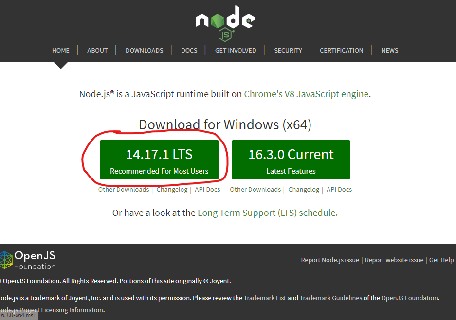
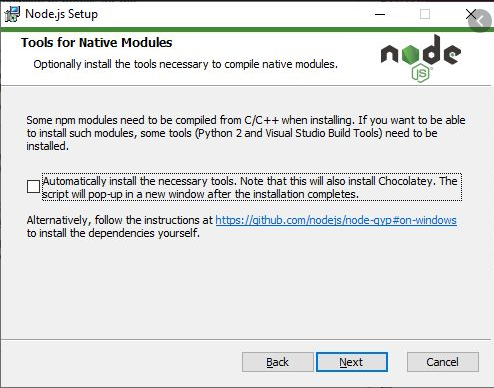
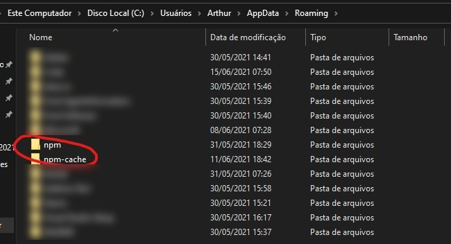
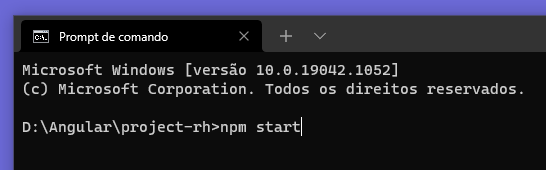
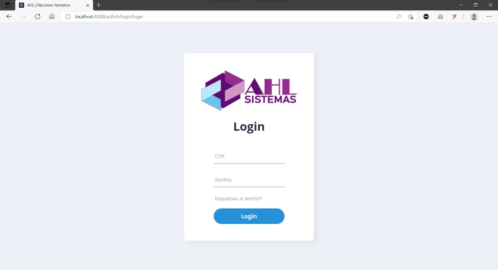

# Instalação do projeto para rodar localmente (Windows 10)

1. A primeira coisa a se fazer é instalar o NodeJS versão LTS que se encontra no site abaixo.

Link: https://nodejs.org/en/

2. Durante a instação do NodeJS, deve-se atentar a tela abaixo, pois quando ela aparecer, o checkbox deverá ser marcado para a instalação de pacotes adicionais que são necessários para o projeto funcionar.

3. Após a conclusão da instalação, será iniciado um PowerShell que prosseguirá com a instalação dos pacotes adicionais (deve demorar alguns minutos). Após a conclusão da instalação dos pacotes adicionais, o computador deverá ser REINICIADO.

4. Após o computador ser reiniciado, recomenda-se apagar as duas pastas abaixo (npm e npm-cache) que estão no path C:\Users\nome-do-usuário\AppData\Roaming:

5. Após a exclusão dessas duas pastas, para evitar quaisquer problemas relacionados ao start da aplicação, deverá ser instalado também outros pacotes relacionados ao Python utilizando-se o comando abaixo.

Comando: `npm install --global windows-build-tools`

Após a instalação desses pacotes, o computador deverá ser reiniciado novamente.

6. Após o processo de instalação do NodeJS e dos pacotes adicionais, basta dar um git clone no projeto com o comando `git clone link-do-repositório`

7. Após o clone do projeto, abra um terminal e navegue até a pasta de onde o projeto se encontra e executa o seguinte comando: `npm start`, na imagem abaixo meu projeto se encontra em D:\Angular\project-rh. Levará alguns segundos para a compilação do programa. Feito a compilação, basta ir ao endereço localhost:4200 em seu navegador de preferência.

